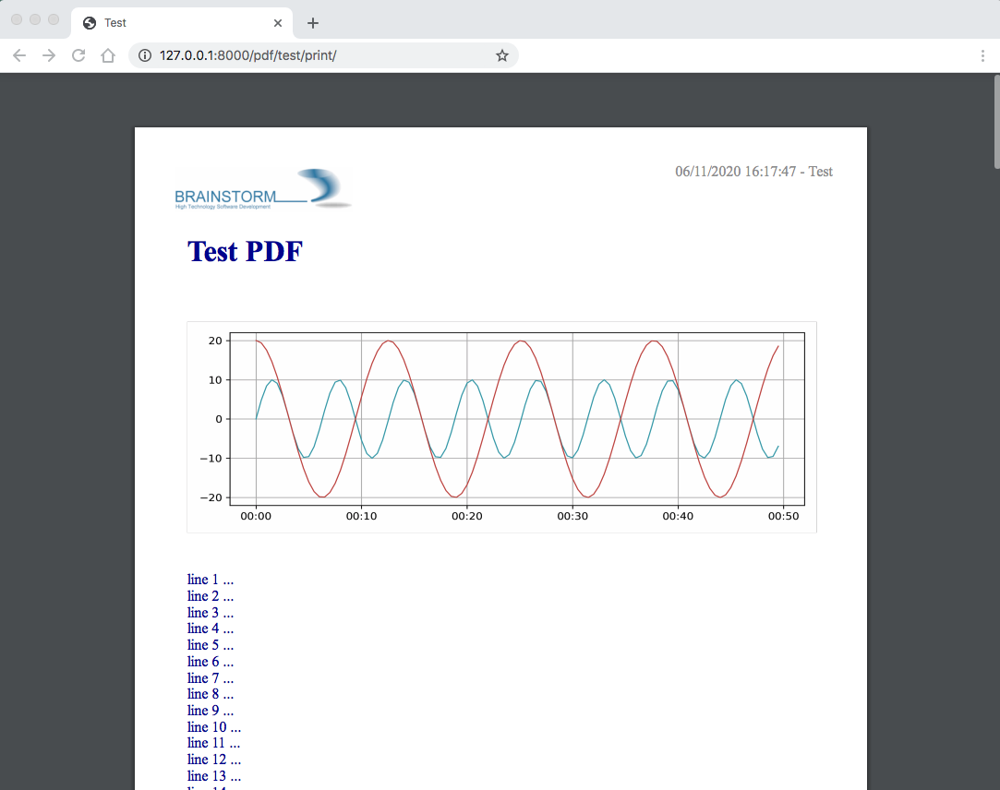
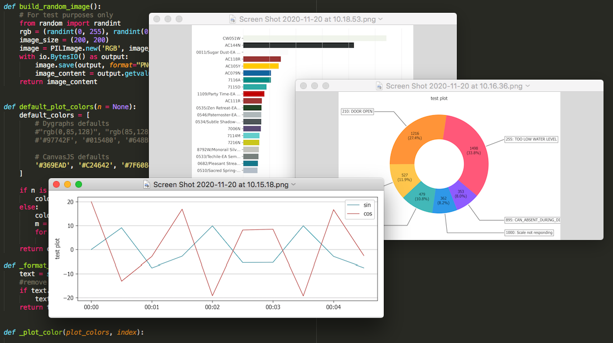

django-pdf
==========

A Django class-based view helper to generate PDF with WeasyPrint.

Requires: `WeasyPrint <https://github.com/Kozea/WeasyPrint>`_

Optional requirements:

- matplotlib (to render plots)

.. contents::

.. sectnum::

Installation
------------

Install the package by running:

.. code:: bash

    pip install django-weasypdf

or:

.. code:: bash

    pip install git+https://github.com/morlandi/django-pdf

You will probably build you own app in the project to provide derived Views
and custom templates; for example:

.. code:: bash

    python manage.py startapp reports

In your settings, add:

.. code:: python

    INSTALLED_APPS = [
        ...
        'reports',
        'pdf',
    ]

Note that `reports` is listed before `pdf` to make sure you can possibly
override any template.

In your urls, add:

.. code:: python

    urlpatterns = [
        ...
        path('reports/', include('reports.urls', namespace='reports')),
        ...

You might want to copy the default templates from 'pdf/templates/pdf' to 'reports/templates/reports'
for any required customization; see `Customizing the templates`_ below

A sample report
---------------

A test view has been provided to render a sample report for demonstration purposes.

In your main urls, include pdf/urls.py, where the required end-point have been
mapped to the PdfTestView; then, visit:

    http://127.0.0.1:8000/pdf/test/print/

You can copy the following to your own app to have an initial working view
to start working with:

file `reports/urls.py`:

.. code:: python

    from django.urls import path
    from . import views

    app_name = 'pdf'

    urlpatterns = [
        path('test/print/', views.ReportTestView.as_view(), {'for_download': False, 'lines': 200, }, name="test-print"),
        path('test/download/', views.ReportTestView.as_view(), {'for_download': True, 'lines': 200, }, name="test-download"),
    ]

file `reports/views.py`:

.. code:: python

    from pdf.views import PdfView

    class ReportView(PdfView):

        #my_custom_data = None
        header_template_name = 'pdf/header.html'
        footer_template_name = 'pdf/footer.html'
        styles_template_name = 'pdf/styles.css'

        def get_context_data(self, **kwargs):
            context = super(ReportView, self).get_context_data(**kwargs)
            #self.my_custom_data = context.pop('my_custom_data', None)
            # context.update({
            #     'footer_line_1': config.REPORT_FOOTER_LINE_1,
            #     'footer_line_2': config.REPORT_FOOTER_LINE_2,
            # })
            return context

    class ReportTestView(ReportView):
        body_template_name = 'pdf/pages/test.html'
        styles_template_name = 'pdf/pages/test.css'
        # header_template_name = None
        # footer_template_name = None
        title = "Report Test"

        def get_context_data(self, **kwargs):
            context = super().get_context_data(**kwargs)

            # Add a plot
            try:
                from .plot import build_plot_from_data
                plot_image = build_plot_from_data(data=None, as_base64=True)
                context.update({
                    'plot_image': plot_image,
                })
            except:
                pass

            # Add your stuff here ...
            context.update({
                ...
            })

            return context

or **replace `pdf/header.html` with `reports/header.html`**, etc ... when using
custom templates.

file `reports/pages/test.html`:

.. code:: html

    

    

        <h1>Test PDF</h1>

        
            
        

        
            
                
line {{forloop.counter}} ...

            
        

    

You can now download the PDF document at:

    http://127.0.0.1:8000/reports/test/download/

or open it with the browser at:

    http://127.0.0.1:8000/reports/test/print/

You can inspect the HTML used for PDF rendering by appending `?format=html` to the url:

    http://127.0.0.1:8000/reports/test/print/?format=html

Building a PDF document from a background process
-------------------------------------------------

A `PdfView.render_as_pdf_to_stream(self, base_url, extra_context, output)` method is supplied for this purpose:

.. code:: python

    def render_as_pdf_to_stream(self, base_url, extra_context, output):
        """
        Build the PDF document and save in into "ouput" stream.

        Automatically called when the view is invoked via HTTP (unless self.format == 'html'),
        but you can also call it explicitly from a background task:

            view = PdfTestView()
            context = view.get_context_data()
            with open(filepath, 'wb') as f:
                view.render_as_pdf_to_stream('', context, f)
        """

A sample management command to build a PDF document outside the HTML request/response
cycle is available here:

`pdf/management/commands/build_test_pdf.py <./pdf/management/commands/build_test_pdf.py>`_

Providing "extra_context" parameters
------------------------------------

Supply context parameters either in the urlpattern, or invoking get_context_data():

from `urls.py`:

.. code:: python

    urlpatterns = [
        path('daily/print/', views.ReportDailyView.as_view(), {'exclude_inactives': False}, name="daily-print"),
    ]

from a background task:

.. code:: python

    from django.core.files.base import ContentFile

    # Create a View to work with
    from reports.views import ReportDailyView
    view = ReportDailyView()
    context = view.get_context_data(
        exclude_inactives=task.exclude_inactives,
    )

    # Create empty file as result
    filename = view.build_filename(extension="pdf")
    task.result.save(filename, ContentFile(''))

    # Open and write result
    filepath = task.result.path

    with open(filepath, 'wb') as f:
        view.render_as_pdf_to_stream('', context, f)

Customizing the templates
-------------------------

These sample files::

    pdf
    ├── static
    │   └── pdf
    │       └── images
    │           └── header_left.png
    └── templates
        └── pdf
            ├── base.html
            ├── base_nomargins.html
            ├── styles.css
            ├── footer.html
            ├── header.html
            └── pages
                ├── test.css
                └── test.html

can be copied into your app's local folder `reports/templates/reports`,
and used for any required customization:

.. code:: python

    class ReportView(PdfView):

        header_template_name = 'reports/header.html'
        footer_template_name = 'reports/footer.html'
        styles_template_name = 'reports/styles.css'

How to insert a page break
--------------------------

.. code:: html

    

Adding Weasyprint to your project
---------------------------------

Add `weasyprint` to your requirements::

    WeasyPrint==51

and optionally to your LOGGING setting::

    LOGGING = {
        ...
        'loggers': {
            ...
            'weasyprint': {
                'handlers': ['console'],
                'level': 'DEBUG',
                'propagate': True,
            },
        },
    }

Deployment:

1) Install Courier fonts for PDF rendering

::

    # You can verify the available fonts as follows:
    #    # fc-list
    - name: Install Courier font for PDF rendering
        become: true
        become_user: root
        copy:
            src: deployment/project/courier.ttf
            dest: /usr/share/fonts/truetype/courier/

The font file can be downloaded here:

`courier.ttf <resources/fonts/courier.ttf>`_

2) You might also need to install the following packages:

::

    #weasyprint_packages:
    - libffi-dev          # http://weasyprint.readthedocs.io/en/latest/install.html#linux
    - python-cffi         # http://weasyprint.readthedocs.io/en/latest/install.html#linux
    - python-dev          # http://weasyprint.readthedocs.io/en/latest/install.html#linux
    - python-pip          # http://weasyprint.readthedocs.io/en/latest/install.html#linux
    - python-lxml         # http://weasyprint.readthedocs.io/en/latest/install.html#linux
    - libcairo2           # http://weasyprint.readthedocs.io/en/latest/install.html#linux
    - libpango1.0-0       # http://weasyprint.readthedocs.io/en/latest/install.html#linux
    - libgdk-pixbuf2.0-0  # http://weasyprint.readthedocs.io/en/latest/install.html#linux
    - shared-mime-info    # http://weasyprint.readthedocs.io/en/latest/install.html#linux
    - libxml2-dev         # http://stackoverflow.com/questions/6504810/how-to-install-lxml-on-ubuntu#6504860
    - libxslt1-dev        # http://stackoverflow.com/questions/6504810/how-to-install-lxml-on-ubuntu#6504860

For an updated list, check here:

https://weasyprint.readthedocs.io/en/latest/install.html#linux

Customizations examples
=======================

Add a custom logo
-----------------

For example you can save a custom bitmap with django-constance:

.. code :: python

    CONSTANCE_ADDITIONAL_FIELDS = {
        'image_field': ['django.forms.ImageField', {}]
    }

    CONSTANCE_CONFIG = {
        ...
        'PDF_RECORD_LOGO': ('', 'Image for PDF logo', 'image_field'),
    }

then in your **header.html** template:

.. code:: html

    <body>
        

            
            
{{print_date|date:'d/m/Y H:i:s'}} - {{title}}

        

    </body>

Embed images from media (ImageFields)
-------------------------------------

If Image is a Model to keep the images you want to embed, use a templatetag like this:

.. code:: python

    @register.filter
    def local_image_url(image_slug):
        """
        Example:
            "/backend/images/signature_mo.png"
        """

        url = ''
        try:
            image = Image.objects.get(slug=image_slug)
            if bool(image.image):
                url = image.image.url.lstrip(settings.MEDIA_URL)
        except Image.DoesNotExist as e:
            pass

        if len(url):
            url = 'media://' + url
        else:
            url = 'static://reports/images/placeholder.png'

        return url

then, in your templates:

.. code:: html

    

where `'report-header-middle'` is the slug used to select the image.

Adding a plot to the PDF documents
==================================

In the frontend, you have many javascript libraries available to plot data and
draw fancy charts.

This doesn't help you in embedding a plot in a PDF documents built offline, however;
in this case, you need to build an image server side.

An helper function has been included in this app for that purpose; to use it, **matplotlib**
must be installed.

At the moment, it is more a POC then a complete solution; you can either use it
from the package, or copy the source file `pdf/plot.py` in your project and use
`build_plot_from_data()` as a starting point:

.. code:: python

    def build_plot_from_data(data, chart_type='line', as_base64=False, dpi=300, ylabel=''):
        """
        Build a plot from given "data";
        Returns: a bitmap of the plot

        Requires:
            matplotlib

        Keyword arguments:
        data -- see sample_line_plot_data() for an example; if None, uses sample_line_plot_data()
        chart_type -- 'line', 'bar', 'horizontalBar', 'pie', 'line', 'doughnut',
        as_base64 -- if True, returns the base64 encoding of the bitmap
        dpi -- bitmap resolution
        ylabel -- optional label for Y axis

        Data layout
        ===========

        Similar to django-jchart:

        - either (shared values for x)

            {
                "labels": ["A", "B", ...],
                "x" [x1, x2, ...],
                "columns": [
                    [ay1, ay2, ...],
                    [by1, by2, ...],
                ],
                "colors": [
                    "rgba(64, 113, 191, 0.2)",
                    "rgba(191, 64, 64, 0.0)",
                    "rgba(26, 179, 148, 0.0)"
                ]
            }

        - or

            {
                "labels": ["A", "B", ..., ],
                "columns": [
                    [
                        {"x": ax1, "y": ay1 },
                        {"x": ax2, "y": ay2 },
                        {"x": ax3, "y": ay3 },
                    ], [
                        {"x": bx1, "y": by1 },
                        {"x": bx2, "y": by2 },
                    ], ...
                ],
                "colors": ["transparent", "rgba(121, 0, 0, 0.2)", "rgba(101, 0, 200, 0.2)", ]
            }

        """

then, in the view, add the resulting bitmap to context:

.. code:: python

    def get_context_data(self, **kwargs):
        context = super().get_context_data(**kwargs)
        try:
            from .plot import build_plot_from_data
            plot_image = build_plot_from_data(data=None, chart_type='line', as_base64=True)
            context.update({
                'plot_image': plot_image,
            })
        except:
            pass
        return context

In the template, render it as an embedded image:

.. code:: html

    

    
        
    

Try it
------

The management command `build_test_pdf` can be used with the "--plot_data" switch to test the resulting image:

.. code:: bash

    python manage.py build_test_pdf test.png -o -p '{"labels": ["sin", "cos"], "x": [0.0, 0.5, 1.0, 1.5, 2.0, 2.5, 3.0, 3.5, 4.0, 4.5], "columns": [[0.0, 9.09, -7.57, -2.79, 9.89, -5.44, -5.37, 9.91, -2.88, -7.51], [20.0, -13.07, -2.91, 16.88, -19.15, 8.16, 8.48, -19.25, 16.68, -2.56]]}' --plot_font Tahoma

|

