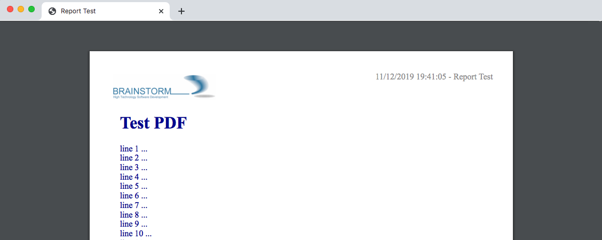

django-pdf
==========

A Django class-based view helper to generate PDF with WeasyPrint.

Requires: `WeasyPrint <https://github.com/Kozea/WeasyPrint>`_

.. contents::

.. sectnum::

Installation
------------

Install the package by running:

.. code:: bash

    pip install git+https://github.com/morlandi/django-pdf

You will probably build you own app in the project to provide derived Views
and custom templates; for example:

.. code:: bash

    python manage.py startapp reports

In your settings, add:

.. code:: python

    INSTALLED_APPS = [
        ...
        'reports',
        'pdf',
    ]

Note that `reports` is listed before `pdf` to make sure you can possibly
override any template.

In your urls, add:

.. code:: python

    urlpatterns = [
        ...
        path('reports/', include('reports.urls', namespace='reports')),
        ...

You might want to copy the default templates from 'pdf/templates/pdf' to 'reports/templates/reports'
for any required customization.

A sample report
---------------

file `reports/urls.py`:

.. code:: python

    from django.urls import path
    from . import views

    app_name = 'reports'

    urlpatterns = [
        path('test/print/', views.ReportTestView.as_view(), {'for_download': False, 'lines': 200, }, name="test-print"),
        path('test/download/', views.ReportTestView.as_view(), {'for_download': True, 'lines': 200, }, name="test-download"),
    ]

file `reports/views.py`:

.. code:: python

    from pdf.views import PdfView

    class ReportView(PdfView):

        #my_custom_data = None
        header_template_name = 'pdf/header.html'
        footer_template_name = 'pdf/footer.html'
        styles_template_name = 'pdf/styles.css'

        def get_context_data(self, **kwargs):
            context = super(ReportView, self).get_context_data(**kwargs)
            #self.my_custom_data = context.pop('my_custom_data', None)
            # context.update({
            #     'footer_line_1': config.REPORT_FOOTER_LINE_1,
            #     'footer_line_2': config.REPORT_FOOTER_LINE_2,
            # })
            return context

    class ReportTestView(ReportView):
        body_template_name = 'pdf/pages/test.html'
        styles_template_name = 'pdf/pages/test.css'
        # header_template_name = None
        # footer_template_name = None
        title = "Report Test"

        def get_context_data(self, **kwargs):
            context = super().get_context_data(**kwargs)
            # Add your stuff here ...
            context.update({
                ...
            })
            return context

or **replace `pdf/header.html` with `reports/header.html`**, etc ... when using
custom templates.

file `pdf/pages/test.html`:

.. code:: html

    

    

        <h1>Test PDF</h1>
        
            
                
line {{forloop.counter}} ...

            
        

    

You can now download the PDF document at:

    http://127.0.0.1:8000/reports/test/download/

or open it with the browser at:

    http://127.0.0.1:8000/reports/test/print/

You can inspect the HTML used for PDF rendering by appending `?format=html` to the url:

    http://127.0.0.1:8000/reports/test/print/?format=html

Source HTML and CSS fine-tuning
-------------------------------

    http://127.0.0.1:8000/reports/test/print/?format=html&debug=1

Default files
-------------

You can copy these sample files in your local folders for any required customization::

    pdf
    ├── static
    │   └── pdf
    │       └── images
    │           └── header_left.png
    └── templates
        └── pdf
            ├── base.html
            ├── base_nomargins.html
            ├── styles.css
            ├── footer.html
            ├── header.html
            └── pages
                ├── test.css
                └── test.html

Building a PDF document from a background process
-------------------------------------------------

A `PdfView.render_as_pdf_to_stream(self, base_url, extra_context, output)` method is supplied for this purpose:

.. code:: python

    def render_as_pdf_to_stream(self, base_url, extra_context, output):
        """
        Build the PDF document and save in into "ouput" stream.

        Automatically called when the view is invoked via HTTP (unless self.format == 'html'),
        but you can also call it explicitly from a background task:

            view = PdfTestView()
            context = view.get_context_data()
            with open(filepath, 'wb') as f:
                view.render_as_pdf_to_stream('', context, f)
        """

A sample management command to build a PDF document outside the HTML request/response
cycle is available here:

`pdf/management/commands/build_test_pdf.py <./pdf/management/commands/build_test_pdf.py>`_

Providing "extra_context" parameters
------------------------------------

Supply context parameters either in the urlpattern, or invoking get_context_data():

from `urls.py`:

.. code:: python

    urlpatterns = [
        path('daily/print/', views.ReportDailyView.as_view(), {'exclude_inactives': False}, name="daily-print"),
    ]

from a background task:

.. code:: python

    from django.core.files.base import ContentFile

    # Create a View to work with
    from reports.views import ReportDailyView
    view = ReportDailyView()
    context = view.get_context_data(
        exclude_inactives=task.exclude_inactives,
    )

    # Create empty file as result
    filename = view.build_filename(extension="pdf")
    task.result.save(filename, ContentFile(''))

    # Open and write result
    filepath = task.result.path

    with open(filepath, 'wb') as f:
        view.render_as_pdf_to_stream('', context, f)

Full customization with templates
---------------------------------

In your base view class, override template names:

.. code:: python

    class ReportView(PdfView):

        header_template_name = 'reports/header.html'
        footer_template_name = 'reports/footer.html'
        styles_template_name = 'reports/styles.css'

Then copy the following default templates into **reports/templates/reports** ::

    pdf
    └── templates
        └── pdf
            ├── base.html
            ├── base_nomargins.html
            ├── styles.css
            ├── footer.html
            └── header.html

and add you customizations.

How to insert a page break
--------------------------

.. code:: html

    

Adding Weasyprint to your project
---------------------------------

Add `weasyprint` to your requirements::

    WeasyPrint==51

and optionally to your LOGGING setting::

    LOGGING = {
        ...
        'loggers': {
            ...
            'weasyprint': {
                'handlers': ['console'],
                'level': 'DEBUG',
                'propagate': True,
            },
        },
    }

Deployment:

1) Install Courier fonts for PDF rendering

::

    # You can verify the available fonts as follows:
    #    # fc-list
    - name: Install Courier font for PDF rendering
        become: true
        become_user: root
        copy:
            src: deployment/project/courier.ttf
            dest: /usr/share/fonts/truetype/courier/

The font file can be downloaded here:

`courier.ttf <resources/fonts/courier.ttf>`_

2) You might also need to install the following packages:

::

    #weasyprint_packages:
    - libffi-dev          # http://weasyprint.readthedocs.io/en/latest/install.html#linux
    - python-cffi         # http://weasyprint.readthedocs.io/en/latest/install.html#linux
    - python-dev          # http://weasyprint.readthedocs.io/en/latest/install.html#linux
    - python-pip          # http://weasyprint.readthedocs.io/en/latest/install.html#linux
    - python-lxml         # http://weasyprint.readthedocs.io/en/latest/install.html#linux
    - libcairo2           # http://weasyprint.readthedocs.io/en/latest/install.html#linux
    - libpango1.0-0       # http://weasyprint.readthedocs.io/en/latest/install.html#linux
    - libgdk-pixbuf2.0-0  # http://weasyprint.readthedocs.io/en/latest/install.html#linux
    - shared-mime-info    # http://weasyprint.readthedocs.io/en/latest/install.html#linux
    - libxml2-dev         # http://stackoverflow.com/questions/6504810/how-to-install-lxml-on-ubuntu#6504860
    - libxslt1-dev        # http://stackoverflow.com/questions/6504810/how-to-install-lxml-on-ubuntu#6504860

For an updated list, check here:

https://weasyprint.readthedocs.io/en/latest/install.html#linux

